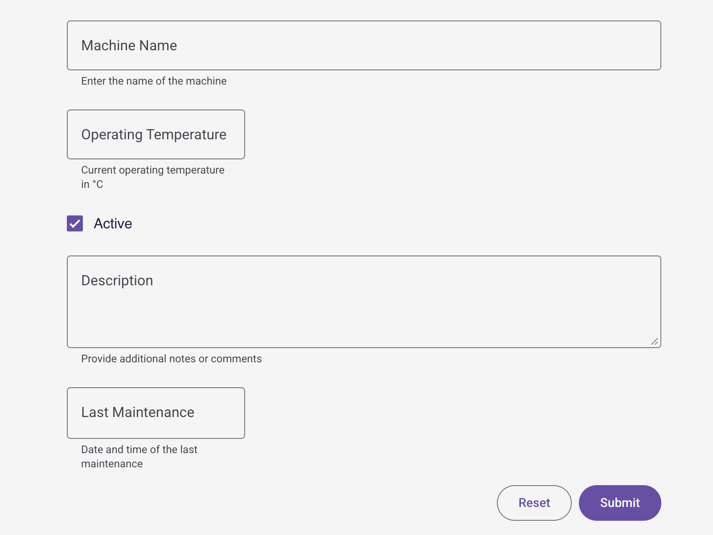

# widget-form

A Lit 3.x web component for creating dynamic forms with configurable fields. Part of the IronFlock widget ecosystem.



## Installation

```bash
npm i @record-evolution/widget-form
```

## Usage

```html
<script type="module">
    import '@record-evolution/widget-form'
</script>

<widget-form-1.0.9></widget-form-1.0.9>
```

> **Note:** The version number is part of the custom element tag name.

## Properties

| Property    | Type        | Description                   |
| ----------- | ----------- | ----------------------------- |
| `inputData` | `InputData` | Form configuration and fields |
| `theme`     | `Theme`     | Theme object for styling      |

## Events

| Event         | Detail                        | Description                      |
| ------------- | ----------------------------- | -------------------------------- |
| `data-submit` | Array of field/value mappings | Fired when the form is submitted |

## Configuration

The form is configured via the `inputData` property:

```ts
interface InputData {
    title?: string
    subTitle?: string
    formButton?: boolean // Show button to open form dialog
    formFields?: FormField[]
}
```

### Field Types

Each form field supports the following types:

| Type          | Description                    |
| ------------- | ------------------------------ |
| `textfield`   | Single-line text input         |
| `numberfield` | Numeric input with min/max     |
| `checkbox`    | Boolean checkbox               |
| `textarea`    | Multi-line text input          |
| `dropdown`    | Select from predefined options |
| `datetime`    | Date/time picker               |

### Field Configuration

```ts
interface FormField {
    label: string
    type: 'dropdown' | 'textfield' | 'numberfield' | 'checkbox' | 'textarea' | 'datetime'
    hiddenField?: boolean // Hide field but still submit value
    required?: boolean // Field must be filled
    description?: string // Hint text shown below field
    targetColumn?: TargetColumn // Database column mapping
    defaultValue?: string
    min?: number // For numberfield
    max?: number // For numberfield
    validation?: string // Regex for textfield
    values?: DropdownValue[] // For dropdown type
}
```

## Development

```bash
# Start dev server
npm run start

# Build for production
npm run build

# Generate types from schema
npm run types

# Build, bump version, and publish
npm run release
```

## License

MIT
